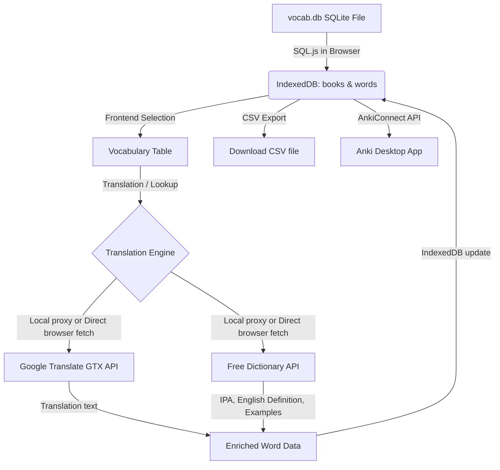

# Kindle Vocabulary to Anki Exporter (AI-Free Mode)

This document is designed for AI developers to quickly understand the structure, architecture, and design principles of the application.

## Overview

Kindle Sync is a local-first, privacy-focused tool that imports Kindle's vocabulary database (`vocab.db`), parses it locally in the browser, fetches translations/definitions without using any AI keys, and exports/synchronizes the results directly into Anki.

## Core Architectural Pillars

### 1. Completely AI-Free Translation
To ensure the app remains fully open-source and free, all translation and dictionary lookup capabilities rely on open-access keyless APIs:
- **Translation**: Uses Google Translate's public `gtx` endpoint (`https://translate.googleapis.com/translate_a/single?client=gtx`). If that fails, it falls back to MyMemory Translation API (`https://api.mymemory.translated.net/get`).
- **Dictionary Lookups**: English words are enriched with phonetic IPA transcriptions, dictionary definitions, and usage examples from the Free Dictionary API (`https://api.dictionaryapi.dev/api/v2/entries/en`).
- **Resilience & Static Mode**: The app first tries to check if the local server is reachable at startup. If the server is offline or not deployed (static-only hosting), it immediately locks the frontend into `serverUnavailable` client-side lookup mode. This avoids useless network 404 proxy calls and performs direct browser fetches for translations.

### 2. Multi-Language Support
Users can select the **Word Language** (Source Language) and **Translation Language** (Target Language) in the frontend.
- **Source Language**: Can be hardcoded or set to "Auto". In "Auto" mode, the app uses the `lang` field parsed directly from the SQLite Kindle database for each word.
- **Target Language**: Defaults to Russian (`ru`), but can be set to any language (persisted in `localStorage`).

### 3. Local SQLite & Storage Sandboxing
- **SQL.js**: The Kindle `vocab.db` database is loaded in-memory inside the browser and parsed using `sql-wasm.js` fetched from CDNJS. No databases are uploaded to external servers.
- **IndexedDB**: Persistent local state (books and words) is saved in the browser's IndexedDB database (`KindleAnkiExporterDB`) with a simple object store.

### 4. Sidebar-Free Layout & Screen Flow
The application layout is sidebar-free, and relies on a clean, top-down linear screen state flow defined in `src/App.tsx` via `currentScreen`:
- **Upload (`"upload"`)**: The entry landing page featuring a centered drag-and-drop box for importing `vocab.db`. If a database is already loaded in IndexedDB, it displays a shortcut banner: `"Manage Vocabulary"`.
- **Manage (`"manage"`)**: The main vocabulary list table. Users can select languages, run bulk translations, edit definitions, and search. A prominent **"Export & Sync"** button at the top right transitions the user to the export page. An **"Import new DB"** button allows uploading a new database.
- **Export (`"export"`)**: The standalone export center. Displays buttons for direct Anki 1-click synchronization and CSV file download. Features a **"← Back to Vocabulary"** button at the top to return to the list.

---

## File Structure

- [server.ts](file:///d:/projects/kindle-vocabulary-to-anki/server.ts): Local Express server serving the Vite application and hosting the `/api/lookup` translation/dictionary proxy to bypass browser CORS rules.
- [src/utils/sqliteParser.ts](file:///d:/projects/kindle-vocabulary-to-anki/src/utils/sqliteParser.ts): Client-side SQLite parsing script that reads tables `WORDS`, `LOOKUPS`, and `BOOK_INFO`.
- [src/utils/db.ts](file:///d:/projects/kindle-vocabulary-to-anki/src/utils/db.ts): IndexedDB wrapper facilitating local operations (saving words/books, updating learning statuses).
- [src/utils/api.ts](file:///d:/projects/kindle-vocabulary-to-anki/src/utils/api.ts): API interface that queries the server-side proxy `/api/lookup` or falls back to direct client-side fetch calls.
- [src/utils/ankiConnect.ts](file:///d:/projects/kindle-vocabulary-to-anki/src/utils/ankiConnect.ts): Handles handshakes and synchronization payloads pushed directly into Anki Desktop.
- [src/utils/csv.ts](file:///d:/projects/kindle-vocabulary-to-anki/src/utils/csv.ts): CSV export script utilizing UTF-8 BOM encoding for proper international character parsing in spreadsheets.
- [src/components/VocabularyTable.tsx](file:///d:/projects/kindle-vocabulary-to-anki/src/components/VocabularyTable.tsx): Core word manager view, detailing statuses (New, Learning, Learned) and containing translation selectors.

---

## Workflow Guide for AI Agents

1. **Adding new APIs**: Make sure all dictionary/translation calls are added to both the local Express proxy in `server.ts` and the direct client-side fallback in `src/utils/api.ts`.
2. **CORS Restrictions**: If you notice requests getting blocked by CORS in the browser, verify if the proxy route `/api/lookup` is working and being resolved.
3. **Database Changes**: If you modify the IndexedDB schema, increment `DB_VERSION` in `src/utils/db.ts` and implement migration code in `onupgradeneeded`.
4. **Git Author**: All repository commits must use the author email `artem.tykhonenko.v@gmail.com` and author name `Artem Tykhonenko`.

